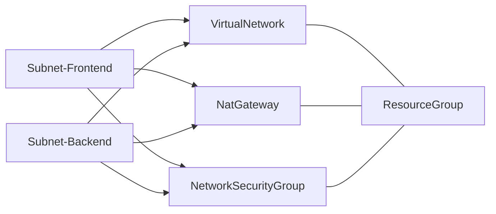

# Breezy DevConf 2025

Demo material for my session at https://breezydevconf.fi

## Architecture

## Presentation and useful links

A pdf with the presentation slides can be found in [presentation.pdf](presentation.pdf)

### Bicep

* Language support extension for Visual Studio Code: https://marketplace.visualstudio.com/items?itemName=ms-azuretools.vscode-bicep
* Overview of Deployment Stacks: https://learn.microsoft.com/en-us/azure/azure-resource-manager/bicep/deployment-stacks?tabs=azure-powershell
* Creating your own extension for bicep local: https://techcommunity.microsoft.com/blog/azuregovernanceandmanagementblog/create-your-own-bicep-local-extension-using-net/4439967

### Terraform

* azapi provider: https://registry.terraform.io/providers/Azure/azapi/latest
* azurerm provider: https://registry.terraform.io/providers/hashicorp/azurerm/latest
* Microsoft Terraform extension for Visual Studio Code: https://marketplace.visualstudio.com/items?itemName=ms-azuretools.vscode-azureterraform
* OpenTofu: https://opentofu.org

### Azure Verified Modules

* Website: https://aka.ms/avm
* Template repository for creating your own terraform modules: https://github.com/Azure/terraform-azurerm-avm-template

### Pulumi / Aspire

* Pulumi docs: https://www.pulumi.com/docs/
* Overview of Aspire: https://learn.microsoft.com/en-us/dotnet/aspire/get-started/aspire-overview

### Entra ID

* msgraph provider: https://registry.terraform.io/providers/microsoft/msgraph/latest